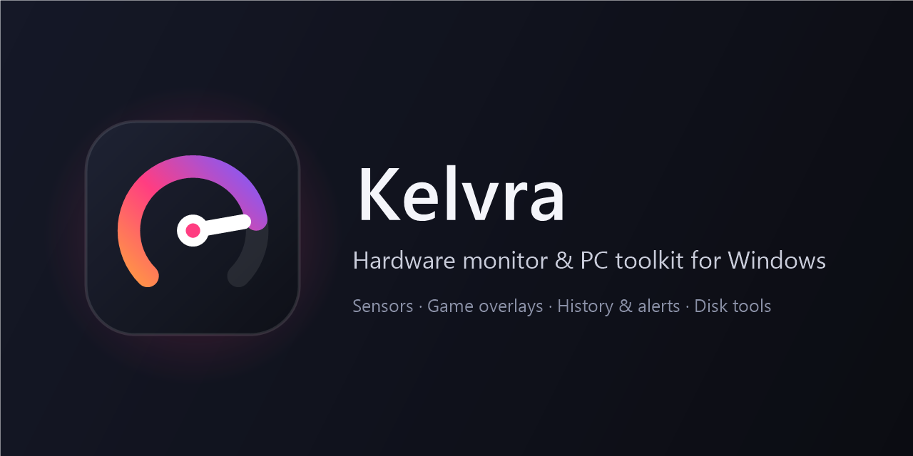
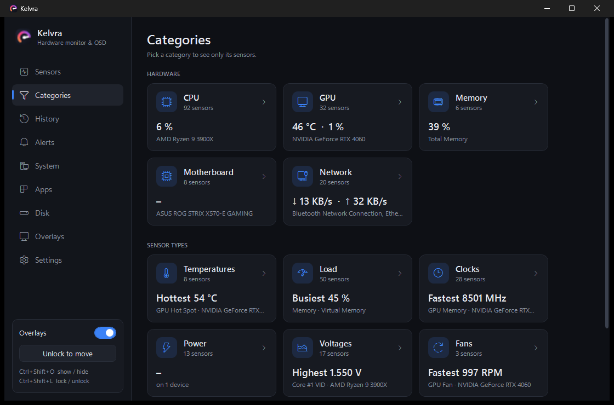
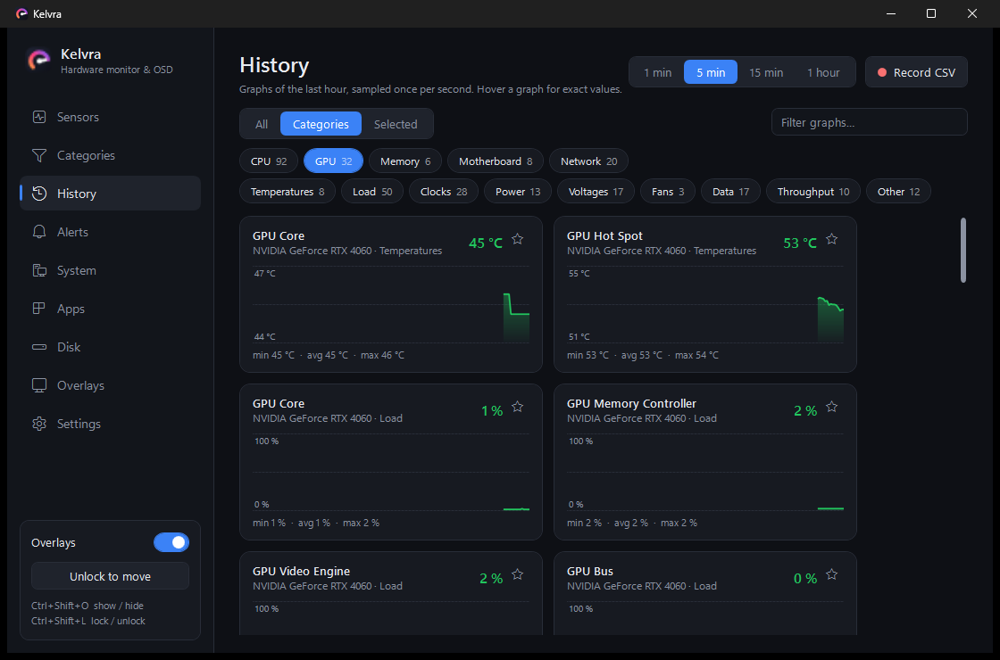
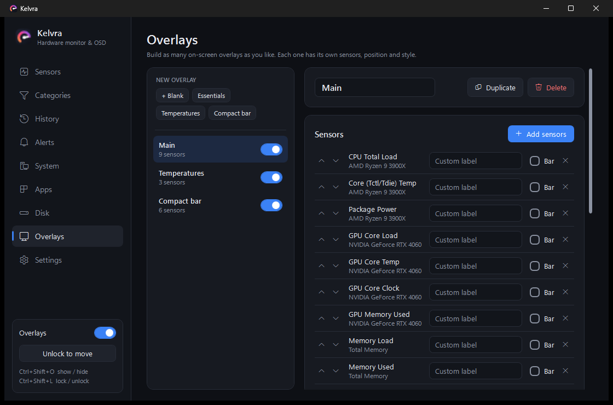

<p align="center">
  
</p>

<p align="center">
  <b>See what your PC is doing – temperatures, clocks, loads and fans – right in your games,<br/>
  and keep it tidy with built-in disk, app and cleanup tools.</b>
</p>

---

## Features

**Monitoring**
- **Sensors** – every sensor LibreHardwareMonitor can read (CPU, GPU, RAM, motherboard, drives, network…) with current / min / max, search, filter chips, foldable device groups you can reorder by drag & drop, and sortable columns.
- **Categories** – one tile per hardware type and sensor type with a live headline (e.g. *GPU 47 °C · 2 %*, *Hottest 55 °C*). Click to filter.
- **History** – graphs of the last hour (1 min / 5 min / 15 min / 1 h) for everything, a category, or your own selection. Hover for exact values.
- **CSV logging** – record whatever you're graphing to a CSV file.
- **Alerts** – Windows notifications when a sensor stays above/below a limit (e.g. *GPU hotter than 85 °C for 5 s*), with cooldown and sound.
- **System summary** – Windows version, CPU, GPU & driver, RAM sticks, board & BIOS, drive health (SMART) and network in one page – with a *Copy summary* button for forum posts.
- °C / °F, dark / light / system theme.

**In-game overlays**
- As many on-screen overlays as you like, each with its own sensors, position, font, colours, opacity, corner radius, vertical or one-line layout, custom labels and progress bars.
- Click-through while locked; `Ctrl+Shift+L` unlocks them for dragging, `Ctrl+Shift+O` shows/hides them.
- Templates: Essentials, Temperatures, Compact bar.

**PC tools**
- **Disk analyzer** – WizTree-style folder tree, file-type breakdown, largest files and a labelled, zoomable treemap. Right-click → open, show in Explorer, move to Recycle Bin.
- **Cleanup** – temp files, NVIDIA/AMD/DirectX shader caches, Windows Update leftovers, crash dumps, browser caches, Recycle Bin. Files in use are skipped.
- **Duplicate finder** – identical files by content (size → partial hash → SHA-256), hard links recognised; extra copies go to the Recycle Bin.
- **Processes** – live CPU / memory / disk per process, end task, open file location.
- **Startup apps** – enable/disable what starts with Windows (same switch as Task Manager).
- **Start with Windows** – Kelvra itself can start minimised in the tray.

## Screenshots

| Categories | History |
|---|---|
|  |  |

| Overlay editor |
|---|
|  |

## Download

1. Grab **`Kelvra.exe`** from the [Releases](../../releases) page (the `.sha256` file next to it lets you verify the download).
2. Kelvra needs the **[.NET 8 Desktop Runtime](https://dotnet.microsoft.com/download/dotnet/8.0)** (x64). If it's missing, Windows offers to download it the first time you start Kelvra.
3. Start `Kelvra.exe`. It asks for administrator rights – that's required to read CPU temperatures, voltages and fan speeds.
4. On first start Kelvra offers to install **PawnIO**, the small signed driver it needs for CPU sensors. You can also do this later under *Settings → Sensor driver*.

> **Windows SmartScreen / antivirus warnings:** Kelvra is not code-signed yet, runs as administrator and can install a driver, so some scanners are cautious. The full source is in this repository and every release is built by GitHub Actions from it – compare the SHA-256 of your download with the one on the release page.

**Requirements:** Windows 10 or 11, 64-bit.

## Build from source

```bash
git clone https://github.com/<Sam-218>/kelvra.git
cd kelvra
dotnet publish Kelvra.csproj -c Release -p:PublishSingleFile=true -p:IncludeNativeLibrariesForSelfExtract=true -o publish
```

- Needs the [.NET 8 SDK](https://dotnet.microsoft.com/download/dotnet/8.0).
- The build downloads the official PawnIO installer once (hash-checked) and embeds it – see `Kelvra.csproj`.
- Releases: push a tag like `v1.0.0` and the [Build workflow](.github/workflows/build.yml) creates a GitHub Release with `Kelvra.exe` and its checksum.
- Optional signing: `scripts/sign.ps1` signs the exe with a self-signed certificate (your name, trusted only on your PC) or with a real code-signing certificate (`-Thumbprint` / `-PfxPath`).

## Project layout

```
Core/        data model: sensors, settings, overlay profiles, disk scanner, alert rules
Services/    sensor polling, history, alerts, CSV logging, overlays, processes, startup apps,
             cleanup, duplicate finder, system info, autostart, PawnIO installer, tray icon
Views/       WPF pages and windows (one page per sidebar entry)
Themes/      dark/light colours and control styles
Assets/      app icon
scripts/     code-signing helper
```

Settings are stored in `%APPDATA%\Kelvra\settings.json`; CSV logs go to `Documents\Kelvra Logs`.
Kelvra has no telemetry and makes no network connections of its own.

## Credits

Sensor data comes from **[LibreHardwareMonitor](https://github.com/LibreHardwareMonitor/LibreHardwareMonitor)**, CPU access uses the **[PawnIO](https://pawnio.eu)** driver by namazso. See [THIRD-PARTY-NOTICES.md](THIRD-PARTY-NOTICES.md).

## License

[MIT](LICENSE)
