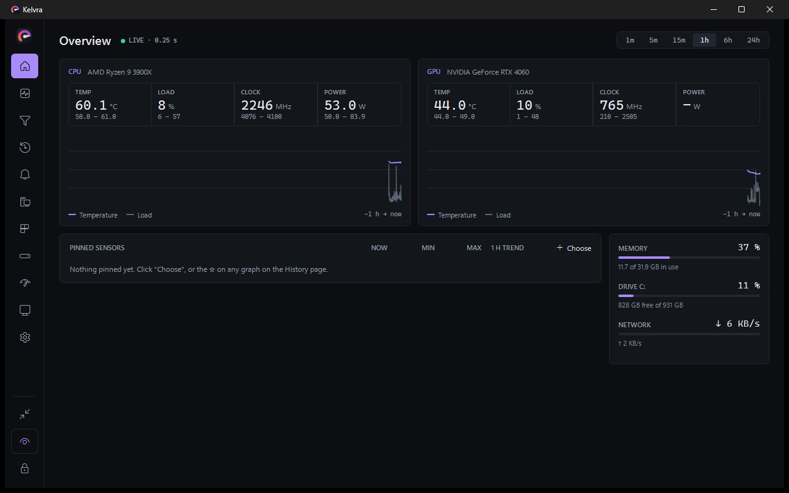
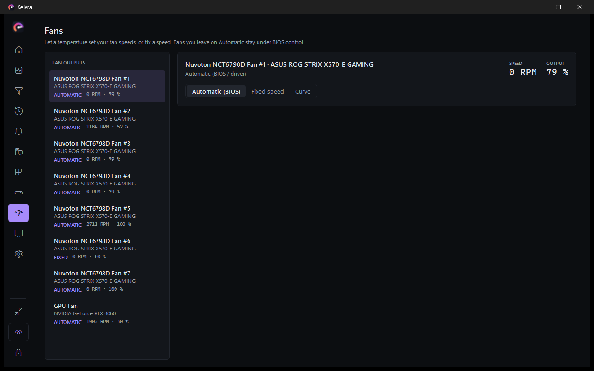

<p align="center">
  
</p>

<p align="center">
  <b>See what your PC is doing – temperatures, clocks, loads and fans – right in your games,<br/>
  and keep it tidy with built-in disk, app and cleanup tools.</b>
</p>

---

## Features

**Monitoring**
- **Overview** – an instrument panel per CPU and GPU (temperature, load, clock, power with their min–max and a graph), the sensors you pinned with a trend line each, and memory / system drive / network at a glance.
- **Sensors** – every sensor LibreHardwareMonitor can read (CPU, GPU, RAM, motherboard, drives, network…) with current / min / max, search, filter chips, foldable device groups you can reorder by drag & drop, and sortable columns.
- **Categories** – one tile per hardware type and sensor type with a live headline (e.g. *GPU 47 °C · 2 %*, *Hottest 55 °C*). Click to filter.
- **History** – graphs of up to 24 hours (every second for the last hour, one-minute averages before that) for everything, a category, or your own selection. Hover for exact values. Optionally kept on disk so graphs survive a restart. *Reset min/max* on the Sensors page starts the extremes over.
- **CSV logging** – record whatever you're graphing to a CSV file.
- **Alerts** – Windows toast notifications (Action Center) when a sensor stays above/below a limit (e.g. *GPU hotter than 85 °C for 5 s*), with cooldown and sound.
- **System summary** – Windows version, CPU, GPU & driver, RAM sticks, board & BIOS, drive health (SMART) and network in one page – with a *Copy summary* button for forum posts.
- **Mini mode** – a small, optionally always-on-top window with CPU, GPU, memory and network, for a second screen.
- °C / °F, dark / light / system theme, seven accent colours.

**Fan control**
- Per fan output: *Automatic* (BIOS/driver), a *fixed speed*, or a *curve* that follows any temperature sensor – drag the points, or type them.
- Safety built in: a minimum speed, 100 % above a critical temperature, gentle slow-down with hysteresis, and fans go back to BIOS control when Kelvra exits, crashes, you sign out, or the temperature sensor disappears.
- Motherboard fans need administrator rights and the PawnIO driver; some laptops and ready-made PCs don't allow software fan control.

**In-game overlays**
- As many on-screen overlays as you like, edited with a live, real-size preview over dark, bright or busy test backgrounds.
- Looks: *Instrument*, *Minimal*, *Classic*, *Glass*, *Neon* or the original – then any installed font (separate font for numbers), weights, sizes, colours, border, panel and overall opacity, corner radius, padding, and a shadow or outline for bright scenes.
- Layouts: list, one line, or tiles in up to six columns, with adjustable spacing, headers and units.
- Per sensor: custom label (or none), its own colour, decimal places, a fill bar, a mini graph, and its own warning limits; warning colours and limits per overlay.
- Position: drag it anywhere, or pin it to any corner or edge of any monitor.
- Click-through while locked; `Ctrl+Alt+F11` unlocks them for dragging, `Ctrl+Alt+F10` shows/hides them. Both shortcuts can be changed (or turned off) under *Settings → Shortcuts*, which also warns when another program uses the same keys.
- Templates: Gaming, Essentials, Temperatures, Compact bar. Export an overlay to a `.kelvra-overlay.json` file and import ones others shared.

**Gaming overlay & FPS**
- FPS and frame times of the game you're playing, measured with Intel PresentMon (DirectX 9–12, Vulkan, OpenGL).
- The *Gaming* overlay appears by itself while a game is in the foreground and hides on the desktop (`Ctrl+Alt+F8` hides it on demand). Turn each part on or off:
  - **FPS** and **frametime**, **1% / 0.1% lows** (last minute), session **average / min / max**
  - a live **frametime graph** of every frame with stutters marked, and a **stutter** counter
  - **bottleneck**: GPU-bound, CPU-bound, or capped by a limiter / VSync
  - **latency** (frame start until it's on screen), **game name**, **play time**, and CPU / GPU load and temperatures
- FPS values are also a *Game* device in the sensor list, so normal overlays, History graphs, alerts (*FPS below 30*) and CSV logging work with them.
- **Game sessions** (History): a summary of every game you played – average FPS, lows, stutters, what limited it, hottest CPU / GPU.
- **Benchmark**: `Ctrl+Alt+F9` records a run and saves its summary plus every frame as CSV.
- Windowed games can be marked under *Settings → Gaming*. Overlays can't draw over true exclusive fullscreen; borderless and most modern games work.

**PC tools**
- **Disk analyzer** – WizTree-style folder tree, file-type breakdown, largest files and a labelled, zoomable treemap. Right-click → open, show in Explorer, move to Recycle Bin.
- **Cleanup** – temp files, NVIDIA/AMD/DirectX shader caches, Windows Update leftovers, crash dumps, browser caches, Recycle Bin. Files in use are skipped.
- **Duplicate finder** – identical files by content (size → partial hash → SHA-256), hard links recognised; extra copies go to the Recycle Bin.
- **Processes** – live CPU / memory / disk per process, end task, open file location.
- **Startup apps** – enable/disable what starts with Windows (same switch as Task Manager), plus scheduled tasks that run at sign-in, which Task Manager doesn't list.
- **Start with Windows** – Kelvra itself can start minimised in the tray.

## Screenshots

| Overview | Fan control |
|---|---|
|  |  |

| Overlay editor | History |
|---|---|
|  |  |

## Download

1. Grab **`Kelvra.exe`** from the [Releases](../../releases) page (the `.sha256` file next to it lets you verify the download).
2. Kelvra needs the **[.NET 10 Desktop Runtime](https://dotnet.microsoft.com/download/dotnet/10.0)** (x64). If it's missing, Windows offers to download it the first time you start Kelvra.
3. Start `Kelvra.exe`. It asks for administrator rights – that's required to read CPU temperatures, voltages and fan speeds.
4. On first start Kelvra offers to install **PawnIO**, the small signed driver it needs for CPU sensors. You can also do this later under *Settings → Sensor driver*.

**Updates:** Kelvra checks GitHub once a day for a new release and asks before installing it. If you click *Not now*, it asks again a day later. *Install and restart* downloads the new `Kelvra.exe`, checks it against the release's SHA-256 and replaces the old one in place, so your settings stay. You can check by hand, or turn the automatic check off, under *Settings → About*.

> **Windows SmartScreen / antivirus warnings:** Kelvra is not code-signed yet, runs as administrator and can install a driver, so some scanners are cautious. The full source is in this repository and every release is built by GitHub Actions from it – compare the SHA-256 of your download with the one on the release page.

**Requirements:** Windows 10 or 11, 64-bit.

## Build from source

```bash
git clone https://github.com/Sam-218/kelvra.git
cd kelvra
dotnet publish Kelvra.csproj -c Release -p:PublishSingleFile=true -p:IncludeNativeLibrariesForSelfExtract=true -o publish
```

- Needs the [.NET 10 SDK](https://dotnet.microsoft.com/download/dotnet/10.0).
- The build downloads the official PawnIO installer and PresentMon once (hash-checked) and embeds them – see `Kelvra.csproj`.
- Releases: push a tag like `v1.0.0` and the [Build workflow](.github/workflows/build.yml) creates a GitHub Release with `Kelvra.exe` and its checksum.
- Tests: `dotnet test tests/Kelvra.Tests` (also run by the Build workflow).

## Project layout

```
Core/        data model: sensors, settings, overlay profiles, disk scanner, alert rules
Services/    sensor polling, history, alerts, CSV logging, overlays, processes, startup apps,
             cleanup, duplicate finder, system info, autostart, PawnIO installer, tray icon
Views/       WPF pages and windows (one page per sidebar entry)
Themes/      dark/light colours and control styles
Assets/      app icon
tests/       xUnit tests (logic, disk tools, safety and security checks)
```

Settings are stored in `%APPDATA%\Kelvra\settings.json` (saved history in `history.bin` next to it, a small error log in `logs\`); CSV logs go to `Documents\Kelvra Logs`.
Kelvra has no telemetry. Its only network connection is the daily update check: it asks GitHub for the latest release, and nothing about your PC is sent. You can turn it off under *Settings → About*. *Settings → About → Copy diagnostics* puts versions, detected hardware and the end of the log on your clipboard for a bug report (your user name is removed); nothing is sent anywhere.

## Uninstall

1. Turn off *Settings → Start with Windows* (removes the sign-in task), then exit Kelvra from the tray.
2. Delete `Kelvra.exe` and the folders `%APPDATA%\Kelvra` (settings) and `Documents\Kelvra Logs` (CSV logs).
3. Optional: uninstall **PawnIO** under *Windows Settings → Apps* if no other program (e.g. FanControl, LibreHardwareMonitor) uses it.

## Credits

Sensor data comes from **[LibreHardwareMonitor](https://github.com/LibreHardwareMonitor/LibreHardwareMonitor)**, CPU access uses the **[PawnIO](https://pawnio.eu)** driver by namazso, and FPS / frame times come from Intel's **[PresentMon](https://github.com/GameTechDev/PresentMon)**. See [THIRD-PARTY-NOTICES.md](THIRD-PARTY-NOTICES.md).

## License

[MIT](LICENSE)
